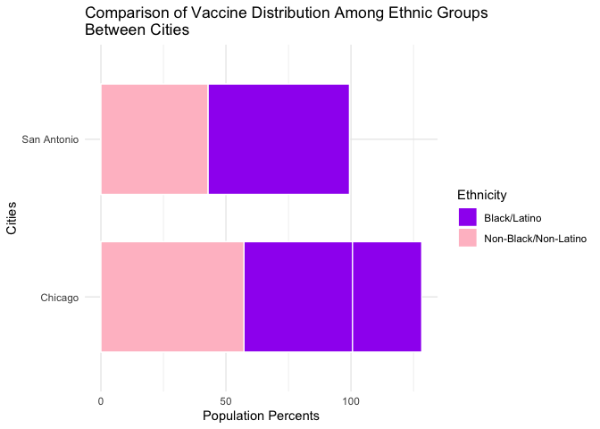

Covid\_Vaccine\_Distrib\_Equity
================
Lauren Wehausen
9/4/2023

57.3% of Chicago’s population is Black or Latino. 71% of San Antonio’s
population is Black or Latino. Chicago has given out 301,000 vaccines
and 43.4% of these were to Black or Latino residents. San Antonio has
given out 266,000 vaccines and 57.2% of these were to Black or Latino
residents. Which of the cities had a more equitable distribution of
vaccines? (This is an open ended question).

``` r
library(ggplot2)
```

    ## Warning: package 'ggplot2' was built under R version 4.1.2

Create the data for the bar plots:

``` r
citypop_BL <- c(57.3, 71)
citypop_other <- c(42.7, 29)
vaxed_BL <- c(43.4, 57.2)
vaxed_other <- c(56.6, 42.8)
cities <- c("Chicago", "San Antonio")
```

Create a data frame with the data created above:

``` r
vaxcities <- data.frame(
  cities = rep(cities, each = 2),
  ethnicity = rep(c("Black/Latino", "Non-Black/Non-Latino"), times = 2),
  citypop = c(citypop_BL, citypop_other),
  vaxed = c(vaxed_BL, vaxed_other)
)
```

Create the double bar plot

``` r
vaxplot <- ggplot(vaxcities, aes(x = cities, y = citypop, fill = ethnicity)) + geom_bar(stat = "identity", position = "stack", width = 0.7, color = "white") + geom_bar(aes(x = cities, y = vaxed), stat = "identity", position = "stack", width = 0.7, color = "white") + labs(y = "Population Percents", x = "Cities", title = "Comparison of Vaccine Distribution Among Ethnic Groups\nBetween Cities") + theme_minimal() + scale_fill_manual(values = c("purple", "pink")) + scale_linetype_manual(values = c("solid", "solid")) + guides(fill = guide_legend(title = "Ethnicity"), linetype = guide_legend(title = "Vaccine Distribution")) + coord_flip()

print(vaxplot)
```

<!-- -->
